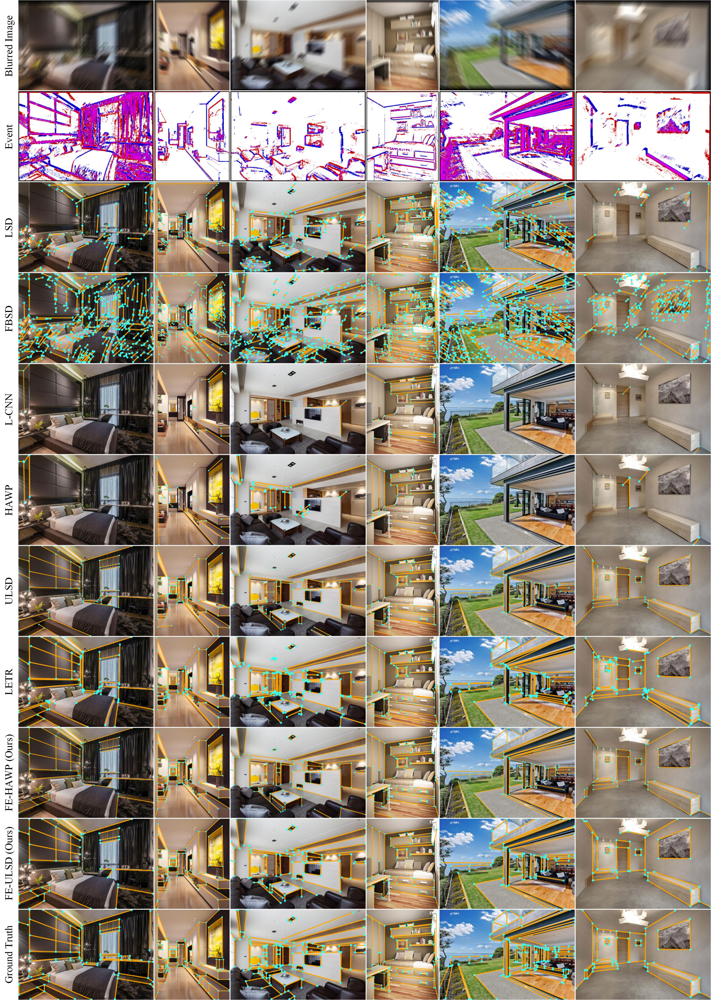
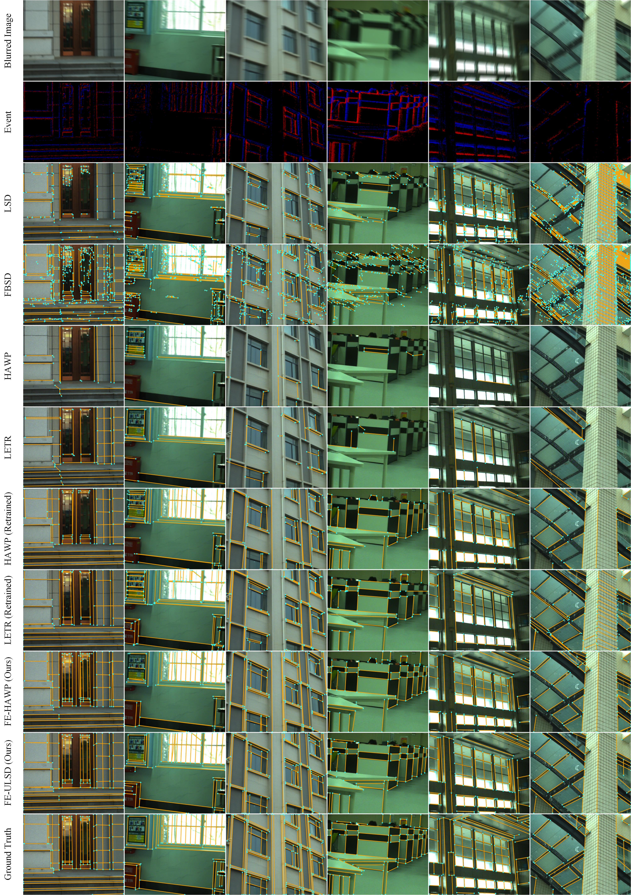

[](https://github.com/lh9171338/Outline) FE-LSD
===========================================================================================================================================

This repository contains the official PyTorch implementation of the paper: [Detecting Line Segments in Motion-blurred Images with Events](https://levenberg.github.io/FE-LSD/).

# Introduction

[FE-LSD](https://levenberg.github.io/FE-LSD/) is an event-enhanced line segment detection framework for motion-blurred images with thoughtful information fusion of both modalities and advanced wireframe parsing network. Extensive results on both synthetic and realistic datasets demonstrate the effectiveness of the proposed method for handling motion blurs in line segment detection.

# Network Architecture

<p align="center"></p>

# Results

## FE-Wireframe Dataset

* Quantitative Comparisons

<html>
<table align="center">
	<tr style = "font-size:10px">
		<td align="center">Method</td>
		<td align="center">sAP<sup>5</sup></td>
		<td align="center">sAP<sup>10</sup></td>
		<td align="center">sAP<sup>15</sup></td>
		<td align="center">msAP</td>
		<td align="center">mAP<sup>J</sup></td>
		<td align="center">AP<sup>H</sup></td>
		<td align="center">F<sup>H</sup></td>
		<td align="center">FPS</td>
	</tr>
	<tr style = "font-size:10px">
		<td align="center">LSD</td>
		<td align="center">0.1</td>
		<td align="center">0.6</td>
		<td align="center">1.1</td>
		<td align="center">0.6</td>
		<td align="center">3.0</td>
		<td align="center">19.5</td>
		<td align="center">42.6</td>
		<td align="center"><b>76.7</b></td>
	</tr>
	<tr style = "font-size:10px">
		<td align="center"><a href="https://github.com/evenp/FBSD">FBSD</a></td>
		<td align="center">0.2</td>
		<td align="center">0.4</td>
		<td align="center">0.9</td>
		<td align="center">0.5</td>
		<td align="center">2.9</td>
		<td align="center">24.9</td>
		<td align="center">47.0</td>
		<td align="center">21.7</td>
	</tr>
	<tr style = "font-size:10px">
		<td align="center"><a href="https://github.com/zhou13/lcnn">L-CNN</a></td>
		<td align="center">3.4</td>
		<td align="center">5.1</td>
		<td align="center">6.2</td>
		<td align="center">4.9</td>
		<td align="center">7.0</td>
		<td align="center">22.7</td>
		<td align="center">38.8</td>
		<td align="center">28.8</td>
	</tr>
	<tr style = "font-size:10px">
		<td align="center"><a href="https://github.com/cherubicXN/hawp">HAWP</a></td>
		<td align="center">3.5</td>
		<td align="center">5.1</td>
		<td align="center">6.3</td>
		<td align="center">5.0</td>
		<td align="center">6.8</td>
		<td align="center">21.7</td>
		<td align="center">40.2</td>
		<td align="center">36.6</td>
	</tr>
	<tr style = "font-size:10px">
		<td align="center"><a href="https://github.com/lh9171338/ULSD-ISPRS">ULSD</a></td>
		<td align="center">3.5</td>
		<td align="center">5.3</td>
		<td align="center">6.8</td>
		<td align="center">5.2</td>
		<td align="center">7.5</td>
		<td align="center">20.2</td>
		<td align="center">40.3</td>
		<td align="center">39.7</td>
	</tr>
	<tr style = "font-size:10px">
		<td align="center"><a href="https://github.com/mlpc-ucsd/LETR">LETR</a></td>
		<td align="center">2.8</td>
		<td align="center">5.0</td>
		<td align="center">6.5</td>
		<td align="center">4.8</td>
		<td align="center">7.3</td>
		<td align="center">21.9</td>
		<td align="center">41.9</td>
		<td align="center">4.2</td>
	</tr>
	<tr style = "font-size:10px">
		<td align="center">L-CNN (Retrained)</td>
		<td align="center">40.6</td>
		<td align="center">45.8</td>
		<td align="center">48.2</td>
		<td align="center">44.8</td>
		<td align="center">45.6</td>
		<td align="center">70.5</td>
		<td align="center">71.1</td>
		<td align="center">10.6</td>
	</tr>
	<tr style = "font-size:10px">
		<td align="center">HAWP (Retrained)</td>
		<td align="center">45.1</td>
		<td align="center">50.4</td>
		<td align="center">52.9</td>
		<td align="center">49.5</td>
		<td align="center">46.8</td>
		<td align="center">75.0</td>
		<td align="center">73.2</td>
		<td align="center">26.8</td>
	</tr>
	<tr style = "font-size:10px">
		<td align="center">ULSD (Retrained)</td>
		<td align="center">47.0</td>
		<td align="center">52.7</td>
		<td align="center">55.2</td>
		<td align="center">51.7</td>
		<td align="center">48.8</td>
		<td align="center">72.2</td>
		<td align="center">73.7</td>
		<td align="center">32.2</td>
	</tr>
	<tr style = "font-size:10px">
		<td align="center">LETR (Retrained)</td>
		<td align="center">24.7</td>
		<td align="center">34.7</td>
		<td align="center">39.7</td>
		<td align="center">33.1</td>
		<td align="center">25.4</td>
		<td align="center">66.1</td>
		<td align="center">71.5</td>
		<td align="center">3.9</td>
	</tr>
	<tr style = "font-size:10px">
		<td align="center">FE-HAWP </td>
		<td align="center">48.7</td>
		<td align="center">53.9</td>
		<td align="center">56.2</td>
		<td align="center">53.0</td>
		<td align="center">49.4</td>
		<td align="center"><b>77.1</b></td>
		<td align="center">75.1</td>
		<td align="center">22.2</td>
	</tr>
	<tr style = "font-size:10px">
		<td align="center">FE-ULSD </td>
		<td align="center"><b>50.9</b></td>
		<td align="center"><b>56.5</b></td>
		<td align="center"><b>58.8</b></td>
		<td align="center"><b>55.4</b></td>
		<td align="center"><b>51.1</b></td>
		<td align="center">75.3</td>
		<td align="center"><b>75.9</b></td>
		<td align="center">24.2</td>
	</tr>
</table>
</html>

* Qualitative Comparisons

<p align="center">
    
</p>

## FE-Blurframe Dataset

* Quantitative Comparisons

<html>
<table align="center">
	<tr style = "font-size:10px">
		<td align="center">Method</td>
		<td align="center">sAP<sup>5</sup></td>
		<td align="center">sAP<sup>10</sup></td>
		<td align="center">sAP<sup>15</sup></td>
		<td align="center">msAP</td>
		<td align="center">mAP<sup>J</sup></td>
		<td align="center">AP<sup>H</sup></td>
		<td align="center">F<sup>H</sup></td>
		<td align="center">FPS</td>
	</tr>
	<tr style = "font-size:10px">
		<td align="center">LSD</td>
		<td align="center">1.1</td>
		<td align="center">2.8</td>
		<td align="center">4.1</td>
		<td align="center">2.7</td>
		<td align="center">5.1</td>
		<td align="center">29.4</td>
		<td align="center">48.1</td>
		<td align="center"><b>61.0</b></td>
	</tr>
	<tr style = "font-size:10px">
		<td align="center"><a href="https://github.com/evenp/FBSD">FBSD</a></td>
		<td align="center">0.9</td>
		<td align="center">1.9</td>
		<td align="center">2.7</td>
		<td align="center">1.8</td>
		<td align="center">5.1</td>
		<td align="center">34.2</td>
		<td align="center">53.2</td>
		<td align="center">15.9</td>
	</tr>
	<tr style = "font-size:10px">
		<td align="center"><a href="https://github.com/zhou13/lcnn">L-CNN</a></td>
		<td align="center">7.5</td>
		<td align="center">11.5</td>
		<td align="center">13.7</td>
		<td align="center">10.9</td>
		<td align="center">12.4</td>
		<td align="center">27.9</td>
		<td align="center">45.2</td>
		<td align="center">29.7</td>
	</tr>
	<tr style = "font-size:10px">
		<td align="center"><a href="https://github.com/cherubicXN/hawp">HAWP</a></td>
		<td align="center">8.4</td>
		<td align="center">12.8</td>
		<td align="center">15.3</td>
		<td align="center">12.2</td>
		<td align="center">12.4</td>
		<td align="center">32.0</td>
		<td align="center">48.2</td>
		<td align="center">38.1</td>
	</tr>
	<tr style = "font-size:10px">
		<td align="center"><a href="https://github.com/lh9171338/ULSD-ISPRS">ULSD</a></td>
		<td align="center">6.8</td>
		<td align="center">10.8</td>
		<td align="center">13.0</td>
		<td align="center">10.2</td>
		<td align="center">11.8</td>
		<td align="center">26.7</td>
		<td align="center">45.6</td>
		<td align="center">40.6</td>
	</tr>
	<tr style = "font-size:10px">
		<td align="center"><a href="https://github.com/mlpc-ucsd/LETR">LETR</a></td>
		<td align="center">7.1</td>
		<td align="center">13.0</td>
		<td align="center">16.8</td>
		<td align="center">12.3</td>
		<td align="center">12.1</td>
		<td align="center">30.2</td>
		<td align="center">51.1</td>
		<td align="center">3.6</td>
	</tr>
	<tr style = "font-size:10px">
		<td align="center">L-CNN (Retrained)</td>
		<td align="center">34.0</td>
		<td align="center">40.3</td>
		<td align="center">43.0</td>
		<td align="center">39.1</td>
		<td align="center">40.3</td>
		<td align="center">66.0</td>
		<td align="center">67.1</td>
		<td align="center">17.7</td>
	</tr>
	<tr style = "font-size:10px">
		<td align="center">HAWP (Retrained)</td>
		<td align="center">37.0</td>
		<td align="center">43.9</td>
		<td align="center">46.9</td>
		<td align="center">42.6</td>
		<td align="center">41.6</td>
		<td align="center">67.9</td>
		<td align="center">69.6</td>
		<td align="center">29.0</td>
	</tr>
	<tr style = "font-size:10px">
		<td align="center">ULSD (Retrained)</td>
		<td align="center">42.0</td>
		<td align="center">47.8</td>
		<td align="center">50.4</td>
		<td align="center">46.7</td>
		<td align="center">48.5</td>
		<td align="center">67.0</td>
		<td align="center">69.3</td>
		<td align="center">32.2</td>
	</tr>
	<tr style = "font-size:10px">
		<td align="center">LETR (Retrained)</td>
		<td align="center">22.6</td>
		<td align="center">33.8</td>
		<td align="center">38.8</td>
		<td align="center">31.7</td>
		<td align="center">23.2</td>
		<td align="center">57.7</td>
		<td align="center">65.4</td>
		<td align="center">3.3</td>
	</tr>
	<tr style = "font-size:10px">
		<td align="center">FE-HAWP</td>
		<td align="center">47.5</td>
		<td align="center">53.0</td>
		<td align="center">55.4</td>
		<td align="center">52.0</td>
		<td align="center">50.9</td>
		<td align="center">74.0</td>
		<td align="center">73.9</td>
		<td align="center">12.9</td>
	</tr>
	<tr style = "font-size:10px">
		<td align="center">FE-ULSD</td>
		<td align="center">47.3</td>
		<td align="center">52.9</td>
		<td align="center">55.2</td>
		<td align="center">51.8</td>
		<td align="center">52.2</td>
		<td align="center">72.9</td>
		<td align="center">73.7</td>
		<td align="center">12.9</td>
	</tr>
	<tr style = "font-size:10px">
		<td align="center">FE-HAWP (Fine-tuned)</td>
		<td align="center"><b>59.8</b></td>
		<td align="center"><b>64.2</b></td>
		<td align="center"><b>65.9</b></td>
		<td align="center"><b>63.3</b></td>
		<td align="center">60.1</td>
		<td align="center"><b>82.0</b></td>
		<td align="center"><b>79.7</b></td>
		<td align="center">21.1</td>
	</tr>
	<tr style = "font-size:10px">
		<td align="center">FE-ULSD (Fine-tuned)</td>
		<td align="center">59.3</td>
		<td align="center">63.8</td>
		<td align="center">65.7</td>
		<td align="center">62.9</td>
		<td align="center"><b>61.0</b></td>
		<td align="center">77.8</td>
		<td align="center">77.1</td>
		<td align="center">21.6</td>
	</tr>
</table>
</html>

* Qualitative Comparisons

<p align="center">
    
</p>

<!-- ## Real Data

<p align="center">
    <br/>Left: HAWP, right: FE-HAWP
</p> -->

# Requirements

* torch>=1.6.0
* torchvision>=0.7.0
* CUDA>=10.1
* lh_tool, matplotlib, numpy, opencv_python, Pillow, scikit_learn, scipy, setuptools, tensorboardX, timm, torch, torchvision, tqdm, yacs,

# Step-by-step installation

```shell
conda create --name FE-LSD python=3.8
conda activate FE-LSD

cd <FE-LSD-Path>
git clone https://github.com/lh9171338/FE-LSD.git
cd FE-LSD

pip install -r requirements.txt

python setup.py build_ext --inplace
```

# Quickstart with the pretrained model

* There are pretrained models in [Google drive](https://drive.google.com/drive/folders/1WGSftMoUgdAFjYjJtMP-JQN0CXiMmKXq?usp=sharing) and [Baiduyun](https://pan.baidu.com/s/19nWYeWQMn9qbvLErHsOyYw?pwd=spth). Please download them and put in the **model/** folder.
* Put your test data in the **dataset/** folder and generate the `test.json` file.

```shell
python image2json.py --dataset_name <DATASET_NAME>
```

* The file structure is as follows:

```
|-- dataset
    |-- events
	|-- 000001.npz
	|-- ...
    |-- images-blur
	|-- 000001.png
	|-- ...
    |-- test.json
```

* Test with the pretrained model. The results are saved in the **output/** folder.

```shell
python test.py --arch <ARCH> --dataset_name <DATASET_NAME> --model_name <MODEL_NAME> --save_image
```

# Training & Testing

## Data Preparation

* Download the dataset from [Baiduyun](https://pan.baidu.com/s/19nWYeWQMn9qbvLErHsOyYw?pwd=spth).
* Unzip the dataset to the **dataset/** folder.
* Convert event streams into synchronous frames using Event Spike Tensor (EST) representation.

```shell
python event2frame.py --dataset_name <DATASET_NAME> --representation EST
ln -s events-EST-10 events
```

## Train

```shell
python train.py --arch FE-HAWP --dataset_name <DATASET_NAME> --model_name <MODEL_NAME> [--gpu <GPU_ID>] # FE-HAWP
python train.py --arch FE-ULSD --dataset_name <DATASET_NAME> --model_name <MODEL_NAME> [--gpu <GPU_ID>] # FE-ULSD
```

## Test

```shell
python test.py --arch FE-HAWP --dataset_name <DATASET_NAME> --model_name <MODEL_NAME> --save_image --with_clear [--gpu <GPU_ID>] # FE-HAWP
python test.py --arch FE-ULSD --dataset_name <DATASET_NAME> --model_name <MODEL_NAME> --save_image --with_clear [--gpu <GPU_ID>] # FE-ULSD
```

## Evaluation

To evaluate the mAP<sup>J</sup>, sAP, and FPS

```shell
python test.py --arch FE-HAWP --dataset_name <DATASET_NAME> --model_name <MODEL_NAME> --evaluate [--gpu <GPU_ID>] # FE-HAWP
python test.py --arch FE-ULSD --dataset_name <DATASET_NAME> --model_name <MODEL_NAME> --evaluate [--gpu <GPU_ID>] # FE-ULSD
```

To evaluate AP<sup>H</sup> and F<sup>H</sup>, MATLAB is required

```shell
cd metric
python eval_APH.py --arch FE-HAWP --dataset_name <DATASET_NAME> --model_name <MODEL_NAME> # FE-HAWP
python eval_APH.py --arch FE-ULSD --dataset_name <DATASET_NAME> --model_name <MODEL_NAME> # FE-ULSD
```
