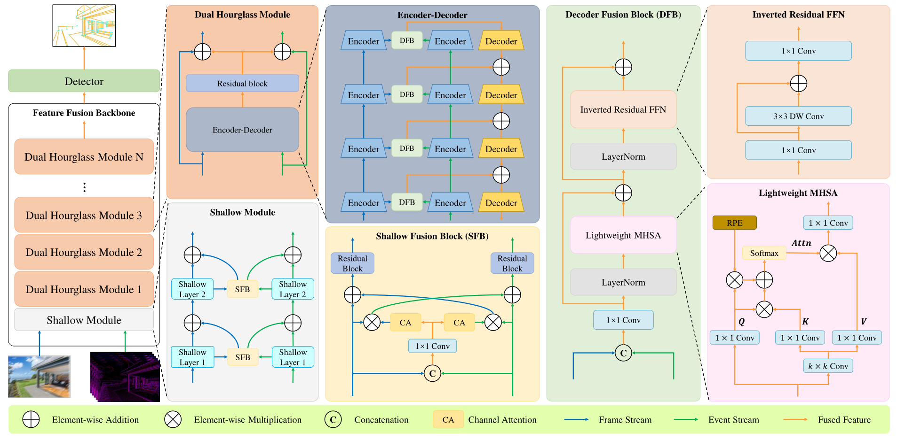

[](https://github.com/lh9171338/Outline) FE-LSD
===
This repository contains the official PyTorch implementation of the paper: [Event-enhanced Line Segment Detection in Motion-blurred Images]().

## Introduction

## Network Architecture
<p align="center"></p>
    
## Results

### Quantitative Comparisons

<html>
<table align="center">
	<tr>
		<td rowspan="2" colspan="1" align="center">Method</td>
		<td rowspan="2" colspan="1" align="center">Training Dataset</td>
		<td rowspan="1" colspan="5" align="center"><a href="https://drive.google.com/drive/folders/1K-pGDDPrXkCmWCcoyYvURZ86ZzA5O6E_?usp=sharing">Mixed Dataset</a></td>
		<td rowspan="2" colspan="1" align="center">FPS</td>
	</tr>
	<tr>
		<td align="center">sAP5</td>
		<td align="center">sAP10</td>
		<td align="center">sAP15</td>
		<td align="center">msAP</td>
		<td align="center">mAPJ</td>
	</tr>
	<tr>
		<td align="center">HT</td>
		<td align="center">-</td>
		<td align="center">0.9</td>
		<td align="center">1.7</td>
		<td align="center">2.5</td>
		<td align="center">1.7</td>
		<td align="center">6.1</td>
		<td align="center">0.3</td>
	</tr>
	<tr>
		<td align="center"><a href="https://github.com/zhou13/lcnn">L-CNN</a></td>
		<td align="center">P</td>
		<td align="center">46.7</td>
		<td align="center">49.9</td>
		<td align="center">51.4</td>
		<td align="center">49.3</td>
		<td align="center">50.6</td>
		<td align="center">13.4</td>
	</tr>
	<tr>
		<td align="center"><a href="https://github.com/cherubicXN/hawp">HAWP</a></td>
		<td align="center">P</td>
		<td align="center">50.3</td>
		<td align="center">53.3</td>
		<td align="center">54.8</td>
		<td align="center">52.8</td>
		<td align="center">50.4</td>
		<td align="center">32.0</td>
	</tr>
	<tr>
		<td align="center">ULSD (Ours)</td>
		<td align="center">P</td>
		<td align="center">50.8</td>
		<td align="center">54.6</td>
		<td align="center">56.4</td>
		<td align="center">53.9</td>
		<td align="center">60.6</td>
		<td align="center"><b>37.0</b></td>
	</tr>
	<tr>
		<td align="center">ULSD (Ours)</td>
		<td align="center">P+F+S</td>
		<td align="center"><b>63.0</b></td>
		<td align="center"><b>67.2</b></td>
		<td align="center"><b>69.1</b></td>
		<td align="center"><b>66.4</b></td>
		<td align="center"><b>61.6</b></td>
		<td align="center">36.9</td>
	</tr>
</table>
</html>

### Qualitative Comparisons

<p align="center">
    
</p> 


## Requirements

* python3
* torch==1.6.0
* torchvision==0.7.0
* CUDA==10.1
* opencv, matplotlib, pillow, numpy, argparse, yacs, tqdm, sklearn, tensorboardX, timm

## Step-by-step installation
```shell
conda create --name FE-LSD python=3.8
conda activate FE-LSD

cd <FE-LSD-Path>
git clone https://github.com/lh9171338/FE-LSD.git
cd FE-LSD

pip install -r requirements.txt
conda install pytorch==1.6.0 torchvision==0.7.0 cudatoolkit=10.1 -c pytorch

python setup.py build_ext --inplace
```

## Quickstart with the pretrained model
* There are pretrained models in [Google drive](). Please download them and put in the **model/** folder.
* Put your test data in the **dataset/** folder and generate the `test.json` file
```
python image2json.py --dataset_name <DATASET_NAME>
```

The file structure is as follows:
```
|-- dataset
    |-- events
        |-- 000001.npz
        |-- ...
    |-- images-blur
        |-- 000001.png
        |-- ...
    |-- test.json
```

* The results are saved in the **output/** folder.
```shell
python test.py --arch <ARCH> --dataset_name <DATASET_NAME> --model_name <MODEL_NAME> --save_image
```

## Training & Testing

### Data Preparation

* Download the dataset from [Google Drive]().
* Unzip the dataset to the **dataset/** folder.
* Convert event streams into synchronous frames with Event Spike Tensor (EST) representation.
```shell
python event2frame.py --dataset_name <DATASET_NAME> --representation EST
ln -s events-EST-10 events
```

### Train

```shell
python train.py --arch FE-HAWP --dataset_name <DATASET_NAME> --model_name <MODEL_NAME> [--gpu <GPU_ID>] # FE-HAWP
python train.py --arch FE-ULSD --dataset_name <DATASET_NAME> --model_name <MODEL_NAME> [--gpu <GPU_ID>] # FE-ULSD
```

### Test

```shell
python test.py --arch FE-HAWP --dataset_name <DATASET_NAME> --model_name <MODEL_NAME> --save_image --with_clear [--gpu <GPU_ID>] # FE-HAWP
python test.py --arch FE-ULSD --dataset_name <DATASET_NAME> --model_name <MODEL_NAME> --save_image --with_clear [--gpu <GPU_ID>] # FE-ULSD
```

### Evaluation

```shell
python test.py --arch FE-HAWP --dataset_name <DATASET_NAME> --model_name <MODEL_NAME> --evaluate [--gpu <GPU_ID>] # FE-HAWP
python test.py --arch FE-ULSD --dataset_name <DATASET_NAME> --model_name <MODEL_NAME> --evaluate [--gpu <GPU_ID>] # FE-ULSD
```
