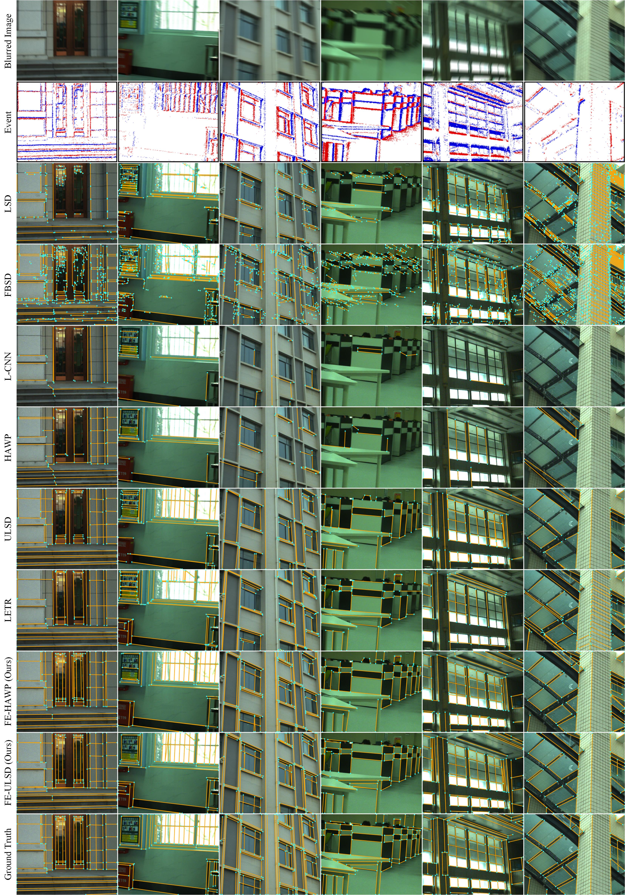

[](https://github.com/lh9171338/Outline) FE-LSD
===
This repository contains the official PyTorch implementation of the paper: [Event-enhanced Line Segment Detection in Motion-blurred Images]().

## Introduction

## Network Architecture
<p align="center"></p>
    
## Results

### FE-Wireframe Dataset

* Quantitative Comparisons

<html>
<table align="center">
	<tr style = "font-size:10px">
		<td align="center">Method</td>
		<td align="center">sAP<sup>5</sup></td>
		<td align="center">sAP<sup>10</sup></td>
		<td align="center">sAP<sup>15</sup></td>
		<td align="center">msAP</td>
		<td align="center">mAP<sup>J</sup></td>
		<td align="center">AP<sup>H</sup></td>
		<td align="center">F<sup>H</sup></td>
		<td align="center">FPS</td>
	</tr>
	<tr style = "font-size:10px">
		<td align="center">LSD</td>
		<td align="center">0.1</td>
		<td align="center">0.6</td>
		<td align="center">1.1</td>
		<td align="center">0.6</td>
		<td align="center">3.0</td>
		<td align="center">19.5</td>
		<td align="center">42.6</td>
		<td align="center"><b>76.7</b></td>
	</tr>
	<tr style = "font-size:10px">
		<td align="center"><a href="https://github.com/evenp/FBSD">FBSD</a></td>
		<td align="center">0.2</td>
		<td align="center">0.4</td>
		<td align="center">0.9</td>
		<td align="center">0.5</td>
		<td align="center">2.9</td>
		<td align="center">24.9</td>
		<td align="center">47.0</td>
		<td align="center">21.7</td>
	</tr>
	<tr style = "font-size:10px">
		<td align="center"><a href="https://github.com/zhou13/lcnn">L-CNN</a></td>
		<td align="center">3.4</td>
		<td align="center">5.1</td>
		<td align="center">6.2</td>
		<td align="center">4.9</td>
		<td align="center">7.0</td>
		<td align="center">22.7</td>
		<td align="center">38.8</td>
		<td align="center">28.8</td>
	</tr>
	<tr style = "font-size:10px">
		<td align="center"><a href="https://github.com/cherubicXN/hawp">HAWP</a></td>
		<td align="center">3.5</td>
		<td align="center">5.1</td>
		<td align="center">6.3</td>
		<td align="center">5.0</td>
		<td align="center">6.8</td>
		<td align="center">21.7</td>
		<td align="center">40.2</td>
		<td align="center">36.6</td>
	</tr>
	<tr style = "font-size:10px">
		<td align="center"><a href="https://github.com/lh9171338/ULSD-ISPRS">ULSD</a></td>
		<td align="center">3.5</td>
		<td align="center">5.3</td>
		<td align="center">6.8</td>
		<td align="center">5.2</td>
		<td align="center">7.5</td>
		<td align="center">20.2</td>
		<td align="center">40.3</td>
		<td align="center">39.7</td>
	</tr>
	<tr style = "font-size:10px">
		<td align="center"><a href="https://github.com/mlpc-ucsd/LETR">LETR</a></td>
		<td align="center">2.8</td>
		<td align="center">5.0</td>
		<td align="center">6.5</td>
		<td align="center">4.8</td>
		<td align="center">7.3</td>
		<td align="center">21.9</td>
		<td align="center">41.9</td>
		<td align="center">4.2</td>
	</tr>
	<tr style = "font-size:10px">
		<td align="center">L-CNN (Retrained)</td>
		<td align="center">40.6</td>
		<td align="center">45.8</td>
		<td align="center">48.2</td>
		<td align="center">44.8</td>
		<td align="center">45.6</td>
		<td align="center">70.5</td>
		<td align="center">71.1</td>
		<td align="center">10.6</td>
	</tr>
	<tr style = "font-size:10px">
		<td align="center">HAWP (Retrained)</td>
		<td align="center">45.1</td>
		<td align="center">50.4</td>
		<td align="center">52.9</td>
		<td align="center">49.5</td>
		<td align="center">46.8</td>
		<td align="center">75.0</td>
		<td align="center">73.2</td>
		<td align="center">26.8</td>
	</tr>
	<tr style = "font-size:10px">
		<td align="center">ULSD (Retrained)</td>
		<td align="center">47.0</td>
		<td align="center">52.7</td>
		<td align="center">55.2</td>
		<td align="center">51.7</td>
		<td align="center">48.8</td>
		<td align="center">72.2</td>
		<td align="center">73.7</td>
		<td align="center">32.2</td>
	</tr>
	<tr style = "font-size:10px">
		<td align="center">LETR (Retrained)</td>
		<td align="center">24.7</td>
		<td align="center">34.7</td>
		<td align="center">39.7</td>
		<td align="center">33.1</td>
		<td align="center">25.4</td>
		<td align="center">66.1</td>
		<td align="center">71.5</td>
		<td align="center">3.9</td>
	</tr>
	<tr style = "font-size:10px">
		<td align="center">FE-HAWP (Ours)</td>
		<td align="center">49.0</td>
		<td align="center">54.3</td>
		<td align="center">56.4</td>
		<td align="center">53.2</td>
		<td align="center">49.4</td>
		<td align="center"><b>77.0</b></td>
		<td align="center"><b>75.5</b></td>
		<td align="center">12.4</td>
	</tr>
	<tr style = "font-size:10px">
		<td align="center">FE-ULSD (Ours)</td>
		<td align="center"><b>50.7</b></td>
		<td align="center"><b>56.2</b></td>
		<td align="center"><b>58.6</b></td>
		<td align="center"><b>55.2</b></td>
		<td align="center"><b>51.1</b></td>
		<td align="center">74.2</td>
		<td align="center">75.1</td>
		<td align="center">13.4</td>
	</tr>
</table>
</html>

* Qualitative Comparisons

<p align="center">
    
</p> 

### FE-WHU Dataset

* Quantitative Comparisons

<html>
<table align="center">
	<tr style = "font-size:10px">
		<td align="center">Method</td>
		<td align="center">sAP<sup>5</sup></td>
		<td align="center">sAP<sup>10</sup></td>
		<td align="center">sAP<sup>15</sup></td>
		<td align="center">msAP</td>
		<td align="center">mAP<sup>J</sup></td>
		<td align="center">AP<sup>H</sup></td>
		<td align="center">F<sup>H</sup></td>
		<td align="center">FPS</td>
	</tr>
	<tr style = "font-size:10px">
		<td align="center">LSD</td>
		<td align="center">1.1</td>
		<td align="center">2.8</td>
		<td align="center">4.1</td>
		<td align="center">2.7</td>
		<td align="center">5.1</td>
		<td align="center">29.4</td>
		<td align="center">48.1</td>
		<td align="center"><b>61.0</b></td>
	</tr>
	<tr style = "font-size:10px">
		<td align="center"><a href="https://github.com/evenp/FBSD">FBSD</a></td>
		<td align="center">0.9</td>
		<td align="center">1.9</td>
		<td align="center">2.7</td>
		<td align="center">1.8</td>
		<td align="center">5.1</td>
		<td align="center">34.2</td>
		<td align="center">53.2</td>
		<td align="center">15.9</td>
	</tr>
	<tr style = "font-size:10px">
		<td align="center"><a href="https://github.com/zhou13/lcnn">L-CNN</a></td>
		<td align="center">7.5</td>
		<td align="center">11.5</td>
		<td align="center">13.7</td>
		<td align="center">10.9</td>
		<td align="center">12.4</td>
		<td align="center">27.9</td>
		<td align="center">45.2</td>
		<td align="center">29.7</td>
	</tr>
	<tr style = "font-size:10px">
		<td align="center"><a href="https://github.com/cherubicXN/hawp">HAWP</a></td>
		<td align="center">8.4</td>
		<td align="center">12.8</td>
		<td align="center">15.3</td>
		<td align="center">12.2</td>
		<td align="center">12.4</td>
		<td align="center">32.0</td>
		<td align="center">48.2</td>
		<td align="center">38.1</td>
	</tr>
	<tr style = "font-size:10px">
		<td align="center"><a href="https://github.com/lh9171338/ULSD-ISPRS">ULSD</a></td>
		<td align="center">6.8</td>
		<td align="center">10.8</td>
		<td align="center">13.0</td>
		<td align="center">10.2</td>
		<td align="center">11.8</td>
		<td align="center">26.7</td>
		<td align="center">45.6</td>
		<td align="center">40.6</td>
	</tr>
	<tr style = "font-size:10px">
		<td align="center"><a href="https://github.com/mlpc-ucsd/LETR">LETR</a></td>
		<td align="center">7.1</td>
		<td align="center">13.0</td>
		<td align="center">16.8</td>
		<td align="center">12.3</td>
		<td align="center">12.1</td>
		<td align="center">30.2</td>
		<td align="center">51.1</td>
		<td align="center">3.6</td>
	</tr>
	<tr style = "font-size:10px">
		<td align="center">L-CNN (Retrained)</td>
		<td align="center">34.0</td>
		<td align="center">40.3</td>
		<td align="center">43.0</td>
		<td align="center">39.1</td>
		<td align="center">40.3</td>
		<td align="center">66.0</td>
		<td align="center">67.1</td>
		<td align="center">17.7</td>
	</tr>
	<tr style = "font-size:10px">
		<td align="center">HAWP (Retrained)</td>
		<td align="center">37.0</td>
		<td align="center">43.9</td>
		<td align="center">46.9</td>
		<td align="center">42.6</td>
		<td align="center">41.6</td>
		<td align="center">67.9</td>
		<td align="center">69.6</td>
		<td align="center">29.0</td>
	</tr>
	<tr style = "font-size:10px">
		<td align="center">ULSD (Retrained)</td>
		<td align="center">42.0</td>
		<td align="center">47.8</td>
		<td align="center">50.4</td>
		<td align="center">46.7</td>
		<td align="center">48.5</td>
		<td align="center">67.0</td>
		<td align="center">69.3</td>
		<td align="center">32.2</td>
	</tr>
	<tr style = "font-size:10px">
		<td align="center">LETR (Retrained)</td>
		<td align="center">22.6</td>
		<td align="center">33.8</td>
		<td align="center">38.8</td>
		<td align="center">31.7</td>
		<td align="center">23.2</td>
		<td align="center">57.7</td>
		<td align="center">65.4</td>
		<td align="center">3.3</td>
	</tr>
	<tr style = "font-size:10px">
		<td align="center">FE-HAWP (Ours)</td>
		<td align="center"><b>47.5</b></td>
		<td align="center"><b>53.0</b></td>
		<td align="center"><b>55.4</b></td>
		<td align="center"><b>52.0</b></td>
		<td align="center">50.9</td>
		<td align="center"><b>74.0</b></td>
		<td align="center"><b>73.9</b></td>
		<td align="center">12.9</td>
	</tr>
	<tr style = "font-size:10px">
		<td align="center">FE-ULSD (Ours)</td>
		<td align="center">47.3</td>
		<td align="center">52.9</td>
		<td align="center">55.2</td>
		<td align="center">51.8</td>
		<td align="center"><b>52.2</b></td>
		<td align="center">72.9</td>
		<td align="center">73.7</td>
		<td align="center">12.9</td>
	</tr>
</table>
</html>

* Qualitative Comparisons

<p align="center">
    
</p> 

### Real Data

<p align="center">
    <br/>Left: HAWP, right: FE-HAWP
</p> 

## Requirements

* python3
* torch==1.6.0
* torchvision==0.7.0
* CUDA==10.1
* opencv, matplotlib, pillow, numpy, argparse, yacs, tqdm, sklearn, tensorboardX, timm

## Step-by-step installation
```shell
conda create --name FE-LSD python=3.8
conda activate FE-LSD

cd <FE-LSD-Path>
git clone https://github.com/lh9171338/FE-LSD.git
cd FE-LSD

pip install -r requirements.txt
conda install pytorch==1.6.0 torchvision==0.7.0 cudatoolkit=10.1 -c pytorch

python setup.py build_ext --inplace
```

## Quickstart with the pretrained model
* There are pretrained models in [Google drive](https://drive.google.com/drive/folders/1WGSftMoUgdAFjYjJtMP-JQN0CXiMmKXq) and [Baiduyun](https://pan.baidu.com/s/19nWYeWQMn9qbvLErHsOyYw?pwd=spth). Please download them and put in the **model/** folder.
* Put your test data in the **dataset/** folder and generate the `test.json` file.
```
python image2json.py --dataset_name <DATASET_NAME>
```

* The file structure is as follows:
```
|-- dataset
    |-- events
	|-- 000001.npz
	|-- ...
    |-- images-blur
	|-- 000001.png
	|-- ...
    |-- test.json
```

* Test with the pretrained model. The results are saved in the **output/** folder.
```shell
python test.py --arch <ARCH> --dataset_name <DATASET_NAME> --model_name <MODEL_NAME> --save_image
```

## Training & Testing

### Data Preparation

* Download the dataset from [Baiduyun](https://pan.baidu.com/s/19nWYeWQMn9qbvLErHsOyYw?pwd=spth).
* Unzip the dataset to the **dataset/** folder.
* Convert event streams into synchronous frames using Event Spike Tensor (EST) representation.
```
python event2frame.py --dataset_name <DATASET_NAME> --representation EST
ln -s events-EST-10 events
```

### Train

```shell
python train.py --arch FE-HAWP --dataset_name <DATASET_NAME> --model_name <MODEL_NAME> [--gpu <GPU_ID>] # FE-HAWP
python train.py --arch FE-ULSD --dataset_name <DATASET_NAME> --model_name <MODEL_NAME> [--gpu <GPU_ID>] # FE-ULSD
```

### Test

```shell
python test.py --arch FE-HAWP --dataset_name <DATASET_NAME> --model_name <MODEL_NAME> --save_image --with_clear [--gpu <GPU_ID>] # FE-HAWP
python test.py --arch FE-ULSD --dataset_name <DATASET_NAME> --model_name <MODEL_NAME> --save_image --with_clear [--gpu <GPU_ID>] # FE-ULSD
```

### Evaluation

```shell
python test.py --arch FE-HAWP --dataset_name <DATASET_NAME> --model_name <MODEL_NAME> --evaluate [--gpu <GPU_ID>] # FE-HAWP
python test.py --arch FE-ULSD --dataset_name <DATASET_NAME> --model_name <MODEL_NAME> --evaluate [--gpu <GPU_ID>] # FE-ULSD
```
